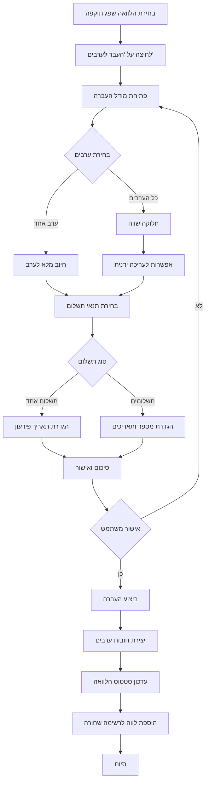

# תכנון מערכת העברת הלוואות לערבים

## סקירה כללית

מערכת העברת הלוואות לערבים תאפשר למנהל הגמ"ח לטפל בהלוואות שלא נפרעו במועד על ידי העברת האחריות לתשלום לערבים. המערכת תכלול דף ייעודי לניהול הלוואות שפג תוקפן, תהליך העברה אינטראקטיבי, וניהול אוטומטי של רשימה שחורה.

## ארכיטקטורה

### רכיבי מערכת קיימים

המערכת הקיימת כוללת:
- **Database Layer** (`src/database/database.ts`) - מנהל את כל הנתונים ב-localStorage
- **Pages** - דפים שונים לניהול לווים, הלוואות, הפקדות ותרומות
- **Components** - רכיבים משותפים כמו BlacklistManager, WarningLetterGenerator
- **AdminToolsPage** - דף כלים מתקדמים עם כרטיסים לפונקציות שונות

### רכיבים חדשים

1. **OverdueLoansPage** - דף חדש לניהול הלוואות שפג תוקפן
2. **LoanTransferModal** - מודל להעברת הלוואה לערבים
3. **GuarantorDebt** - מבנה נתונים חדש לחובות ערבים
4. **Database Methods** - מתודות חדשות לטיפול בהעברות

## מבני נתונים

### DatabaseGuarantorDebt (חדש)

```typescript
export interface DatabaseGuarantorDebt {
  id: number
  originalLoanId: number          // קישור להלוואה המקורית
  guarantorId: number             // ID הערב שחויב
  originalBorrowerId: number      // ID הלווה המקורי
  amount: number                  // סכום החוב
  transferDate: string            // תאריך העברה
  transferredBy: string           // מי ביצע את ההעברה
  paymentType: 'single' | 'installments'  // סוג תשלום
  installmentsCount?: number      // מספר תשלומים (אם רלוונטי)
  installmentAmount?: number      // סכום כל תשלום
  installmentDates?: string[]     // תאריכי פירעון לכל תשלום
  status: 'active' | 'paid' | 'overdue'
  notes?: string
}
```

### DatabaseLoan (עדכון)

הוספת שדות חדשים:

```typescript
export interface DatabaseLoan {
  // ... שדות קיימים
  transferredToGuarantors?: boolean    // האם הועברה לערבים
  transferDate?: string                // תאריך העברה
  transferredBy?: string               // מי ביצע את ההעברה
  transferNotes?: string               // הערות על ההעברה
}
```

### DatabasePayment (עדכון)

הוספת שדה לזיהוי תשלומי ערבים:

```typescript
export interface DatabasePayment {
  // ... שדות קיימים
  guarantorDebtId?: number  // קישור לחוב ערב (אם רלוונטי)
}
```

## רכיבים וממשקים

### 1. OverdueLoansPage

**מיקום**: `src/pages/OverdueLoansPage.tsx`

**תפקיד**: דף ריכוז הלוואות שפג תוקפן עם אפשרות להעברה לערבים

**מבנה**:
```typescript
interface OverdueLoan {
  loan: DatabaseLoan
  borrower: DatabaseBorrower
  guarantors: DatabaseGuarantor[]
  daysOverdue: number
  balance: number
}
```

**פונקציונליות**:
- טעינת כל ההלוואות שעבר מועד הפירעון שלהן
- חישוב ימי איחור לכל הלוואה
- הצגת פרטי לווה וערבים
- כפתור "העבר לערבים" לכל הלוואה
- סינון ומיון הלוואות
- עיצוב תואם לדפים הקיימים

### 2. LoanTransferModal

**מיקום**: `src/components/LoanTransferModal.tsx`

**תפקיד**: מודל אינטראקטיבי להעברת הלוואה לערבים

**שלבי התהליך**:

1. **בחירת ערבים**
   - הצגת רשימת ערבים של ההלוואה
   - אפשרות לבחור ערב אחד או את כולם
   - הצגת אזהרה אם ערב ברשימה שחורה

2. **חלוקת סכום**
   - אם נבחר ערב אחד - כל הסכום אליו
   - אם נבחרו כל הערבים - חלוקה שווה
   - אפשרות לעריכה ידנית של החלוקה
   - הצגת סכום לכל ערב

3. **תנאי תשלום**
   - בחירה בין "תשלום אחד" ו"תשלומים"
   - אם תשלומים:
     - הגדרת מספר תשלומים
     - חישוב אוטומטי של סכום כל תשלום
     - הגדרת תאריכי פירעון

4. **אישור סופי**
   - סיכום כל הפרטים
   - אישור סופי לפני ביצוע

### 3. GuarantorDebtsView

**מיקום**: `src/components/GuarantorDebtsView.tsx`

**תפקיד**: תצוגה של חובות ערבים בדף ההלוואות

**פונקציונליות**:
- הצגת חובות ערב בדף ההלוואות
- סימון ויזואלי מובחן מהלוואות רגילות
- קישור להלוואה המקורית
- הצגת תוכנית תשלומים
- אפשרות לרישום פרעון

## לוגיקת העסקים

### תהליך העברת הלוואה



### חישוב חלוקת סכומים

```typescript
function splitAmountBetweenGuarantors(
  totalAmount: number,
  guarantorIds: number[]
): Map<number, number> {
  const count = guarantorIds.length
  const baseAmount = Math.floor((totalAmount * 100) / count) / 100 // עיגול לאגורה
  const remainder = totalAmount - (baseAmount * count)
  
  const split = new Map<number, number>()
  guarantorIds.forEach((id, index) => {
    // הערב הראשון מקבל את ההפרש
    split.set(id, index === 0 ? baseAmount + remainder : baseAmount)
  })
  
  return split
}
```

### ניהול רשימה שחורה אוטומטי

**הוספת לווה לרשימה שחורה**:
- מתבצעת אוטומטית בעת העברת הלוואה לערבים
- סיבה: "לא פרע הלוואה - הועבר לערבים"
- קישור להלוואה המקורית

**הוספת ערב לרשימה שחורה**:
- מתבצעת כאשר ערב לא פרע חוב עד מועד הפירעון
- בדיקה יומית/שבועית של חובות ערבים
- סיבה: "לא פרע חוב כערב"
- קישור לחוב הערב

## אסטרטגיית טיפול בשגיאות

### ולידציות לפני העברה

1. **בדיקת ערבים**:
   - וידוא שיש לפחות ערב אחד
   - בדיקה שהערבים לא ברשימה שחורה
   - אזהרה אם ערב כבר חויב בעבר

2. **בדיקת סכומים**:
   - וידוא שסכום החלוקה שווה לסכום ההלוואה
   - בדיקה שאין סכומים שליליים
   - עיגול נכון לאגורה

3. **בדיקת תאריכים**:
   - תאריכי פירעון לא בעבר
   - תאריכים הגיוניים (לא רחוקים מדי)

### טיפול בכשלים

- **כשל בשמירה**: הצגת הודעת שגיאה ושמירת נתונים ב-log
- **כשל בעדכון רשימה שחורה**: המשך תהליך אבל התראה למשתמש
- **ביטול באמצע**: rollback של כל השינויים

## אסטרטגיית בדיקות

### בדיקות יחידה

1. **חישוב חלוקת סכומים**:
   - חלוקה שווה בין 2 ערבים
   - חלוקה שווה בין 3 ערבים (עם שארית)
   - חלוקה עם עריכה ידנית

2. **זיהוי הלוואות שפג תוקפן**:
   - הלוואה שעבר מועד הפירעון
   - הלוואה שטרם עבר מועד הפירעון
   - הלוואה שנפרעה במלואה

3. **יצירת חובות ערבים**:
   - יצירת חוב בודד
   - יצירת מספר חובות
   - יצירת חוב עם תשלומים

### בדיקות אינטגרציה

1. **תהליך העברה מלא**:
   - העברה לערב אחד
   - העברה לכל הערבים
   - העברה עם תשלומים

2. **עדכון רשימה שחורה**:
   - הוספת לווה אוטומטית
   - הוספת ערב אוטומטית
   - בדיקת חסימה בהלוואה חדשה

3. **תצוגת חובות ערבים**:
   - הצגה בדף הלוואות
   - רישום פרעון
   - עדכון סטטוס

## שיקולי ביצועים

### אופטימיזציות

1. **טעינת נתונים**:
   - טעינה עצלה של פרטי ערבים
   - cache של הלוואות שפג תוקפן
   - עדכון מצטבר של רשימה שחורה

2. **חישובים**:
   - חישוב מראש של יתרות הלוואות
   - cache של ימי איחור
   - עדכון אסינכרוני של סטטיסטיקות

3. **UI**:
   - רינדור וירטואלי לרשימות ארוכות
   - debounce לחיפוש וסינון
   - lazy loading של מודלים

## שיקולי אבטחה

### הרשאות

- רק מנהלי גמ"ח יכולים להעביר הלוואות לערבים
- תיעוד מלא של כל פעולה (מי, מתי, למה)
- אישור כפול לפעולות קריטיות

### שמירת נתונים

- גיבוי אוטומטי לפני כל העברה
- שמירת היסטוריה מלאה
- אפשרות לביטול פעולה (בתנאים מסוימים)

## תכנית מימוש

### שלב 1: מבני נתונים ו-Database

1. הוספת interface `DatabaseGuarantorDebt`
2. עדכון `DatabaseLoan` עם שדות העברה
3. הוספת מתודות ל-`GemachDatabase`:
   - `addGuarantorDebt()`
   - `getGuarantorDebts()`
   - `getGuarantorDebtsByGuarantorId()`
   - `transferLoanToGuarantors()`
   - `updateGuarantorDebtStatus()`

### שלב 2: דף הלוואות שפג תוקפן

1. יצירת `OverdueLoansPage.tsx`
2. הוספת route ב-`App.tsx`
3. הוספת כרטיס ב-`AdminToolsPage.tsx`
4. לוגיקת זיהוי הלוואות שפג תוקפן
5. עיצוב תואם לדפים קיימים

### שלב 3: מודל העברה

1. יצירת `LoanTransferModal.tsx`
2. שלב בחירת ערבים
3. שלב חלוקת סכומים
4. שלב תנאי תשלום
5. שלב אישור סופי

### שלב 4: ניהול חובות ערבים

1. יצירת `GuarantorDebtsView.tsx`
2. אינטגרציה בדף הלוואות
3. לוגיקת רישום פרעונות
4. עדכון סטטוסים

### שלב 5: רשימה שחורה אוטומטית

1. לוגיקת הוספה אוטומטית של לווה
2. לוגיקת הוספה אוטומטית של ערב
3. בדיקות תקופתיות של חובות
4. אינטגרציה עם מערכת קיימת

### שלב 6: דוחות ומעקב

1. דוח הלוואות מועברות
2. דוח חובות ערבים
3. סטטיסטיקות
4. ייצוא לקבצים

## שיקולי UX

### עיצוב ויזואלי

- **צבעים**:
  - הלוואות שפג תוקפן: אדום (#e74c3c)
  - חובות ערבים: כתום (#f39c12)
  - הלוואות מועברות: סגול (#9b59b6)

- **אייקונים**:
  - ⏰ הלוואות שפג תוקפן
  - 🔄 העברה לערבים
  - 🤝 חובות ערבים
  - 🚫 רשימה שחורה

### הודעות למשתמש

- הודעות הצלחה ברורות
- אזהרות לפני פעולות בלתי הפיכות
- הסברים על השלכות כל פעולה
- התראות על בעיות פוטנציאליות

### נגישות

- תמיכה במקלדת מלאה
- תוויות ARIA מתאימות
- ניגודיות צבעים גבוהה
- גדלי פונט קריאים

## תיעוד

### תיעוד למשתמש

- מדריך שימוש בדף הלוואות שפג תוקפן
- הסבר על תהליך העברה לערבים
- דוגמאות לתרחישים נפוצים
- שאלות נפוצות

### תיעוד טכני

- תיעוד API של מתודות חדשות
- דיאגרמות זרימה
- דוגמאות קוד
- הערות על החלטות עיצוב

## תחזוקה והרחבות עתידיות

### תחזוקה

- ניטור ביצועים
- תיקון באגים
- עדכוני אבטחה
- גיבויים תקופתיים

### הרחבות אפשריות

1. **התראות אוטומטיות**:
   - SMS/Email לערבים על חיוב
   - התראות על תשלומים קרובים
   - דוחות תקופתיים

2. **ניהול משא ומתן**:
   - הצעות לפריסה מחדש
   - הנחות על תשלום מיידי
   - תיעוד הסכמים

3. **אינטגרציות**:
   - מערכות תשלום אוטומטיות
   - מערכות CRM
   - כלי דיווח מתקדמים

4. **ניתוח נתונים**:
   - חיזוי סיכונים
   - ניתוח דפוסי תשלום
   - המלצות על ערבים
