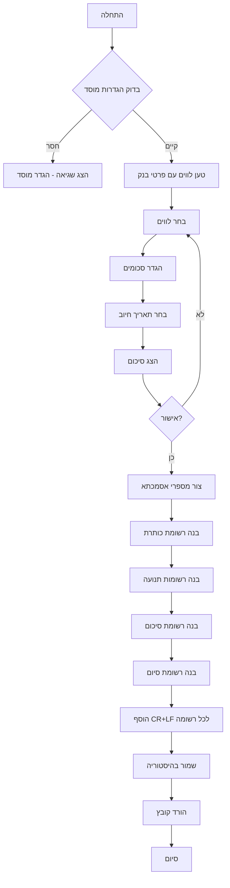

# תכנון מערכת יצירת קבצי מס"ב

## סקירה כללית

מערכת יצירת קבצי מס"ב תאפשר למנהל הגמ"ח ליצור קבצים בפורמט Fixed Width המדויק של מס"ב לצורך גביית תשלומים מלווים. המערכת תכלול ניהול פרטי בנק ללווים, בחירת לווים לגביה, והפקת קובץ טקסט מוכן להעלאה למס"ב.

## ארכיטקטורה

### רכיבי מערכת קיימים

- **Database Layer** - מנהל נתונים ב-localStorage
- **Borrowers Management** - ניהול לווים
- **Loans Management** - ניהול הלוואות
- **Settings** - הגדרות מערכת

### רכיבים חדשים

1. **MasavSettings** - הגדרות מוסד למס"ב
2. **MasavFileGenerator** - דף יצירת קובץ מס"ב
3. **MasavFileBuilder** - לוגיקת בניית הקובץ
4. **MasavHistory** - היסטוריית קבצים

## מבני נתונים

### הרחבת DatabaseBorrower

```typescript
export interface DatabaseBorrower {
  // ... שדות קיימים
  
  // פרטי בנק למס"ב
  bankCode?: string              // קוד בנק (2 ספרות)
  branchNumber?: string          // מספר סניף (3 ספרות)
  accountNumber?: string         // מספר חשבון (9 ספרות)
  accountHolderName?: string     // שם בעל החשבון (אם שונה)
}
```

### MasavSettings (חדש)

```typescript
export interface MasavSettings {
  institutionCode: string        // קוד מוסד/נושא (8 ספרות)
  senderCode: string             // מספר מוסד שולח (5 ספרות)
  institutionName: string        // שם המוסד (30 תווים)
  lastReferenceNumber: number    // מספר אסמכתא אחרון
}
```

### MasavCharge (חדש)

```typescript
export interface MasavCharge {
  borrowerId: number
  borrowerName: string
  idNumber: string
  bankCode: string
  branchNumber: string
  accountNumber: string
  amount: number                 // בשקלים (כולל אגורות)
  referenceNumber: string        // מספר אסמכתא (20 תווים)
  chargeDate: string            // תאריך חיוב
  loanId?: number               // קישור להלוואה (אופציונלי)
}
```

### MasavFileRecord (חדש)

```typescript
export interface MasavFileRecord {
  id: number
  creationDate: string
  chargeDate: string
  totalAmount: number
  chargesCount: number
  charges: MasavCharge[]
  fileName: string
  fileContent: string           // תוכן הקובץ לשמירה
}
```

## רכיבים וממשקים

### 1. MasavSettingsPage

**מיקום**: `src/pages/MasavSettingsPage.tsx`

**תפקיד**: דף הגדרות מוסד למס"ב

**פונקציונליות**:
- הצגת הגדרות נוכחיות
- עריכת קוד מוסד (8 ספרות)
- עריכת מספר מוסד שולח (5 ספרות)
- עריכת שם מוסד (30 תווים)
- ולידציה של כל השדות
- שמירת הגדרות
- איפוס מונה אסמכתאות

### 2. MasavFileGeneratorPage

**מיקום**: `src/pages/MasavFileGeneratorPage.tsx`

**תפקיד**: דף יצירת קובץ מס"ב

**שלבי התהליך**:

#### שלב 1: בחירת לווים
- טעינת רשימת לווים עם הלוואות פעילות
- סינון לווים שיש להם פרטי בנק
- בחירה מרובה של לווים
- הצגת יתרה לכל לווה
- סינון לפי שם, סכום, סטטוס

#### שלב 2: הגדרת סכומים
- הצגת סכום מוצע (יתרה) לכל לווה
- אפשרות לעריכה ידנית
- ולידציה שהסכום לא עולה על יתרה
- חישוב סך כל הסכומים

#### שלב 3: הגדרת תאריך חיוב
- בחירת תאריך חיוב
- ברירת מחדל: תאריך נוכחי
- ולידציה שהתאריך לא בעבר

#### שלב 4: סיכום ואישור
- הצגת כל הלווים והסכומים
- הצגת סך הכל
- הצגת תאריך חיוב
- אישור סופי

#### שלב 5: יצירת קובץ
- בניית הקובץ
- הורדת הקובץ
- שמירת רשומה בהיסטוריה

### 3. MasavFileBuilder

**מיקום**: `src/utils/masavFileBuilder.ts`

**תפקיד**: בניית קובץ מס"ב בפורמט הנכון

**פונקציות עיקריות**:

```typescript
class MasavFileBuilder {
  // בניית רשומת כותרת
  buildHeaderRecord(
    institutionCode: string,
    chargeDate: Date,
    creationDate: Date,
    senderCode: string,
    institutionName: string
  ): string

  // בניית רשומת תנועה
  buildTransactionRecord(
    institutionCode: string,
    charge: MasavCharge
  ): string

  // בניית רשומת סיכום
  buildSummaryRecord(
    institutionCode: string,
    chargeDate: Date,
    totalAmount: number,
    transactionsCount: number
  ): string

  // בניית רשומת סיום
  buildEndRecord(): string

  // בניית קובץ מלא
  buildFile(
    settings: MasavSettings,
    charges: MasavCharge[],
    chargeDate: Date
  ): string

  // פונקציות עזר
  padLeft(value: string, length: number, char: string): string
  padRight(value: string, length: number, char: string): string
  formatAmount(amount: number): string  // 11 ש"ח + 2 אגורות
  formatDate(date: Date): string        // YYMMDD
}
```

### 4. MasavHistoryPage

**מיקום**: `src/pages/MasavHistoryPage.tsx`

**תפקיד**: היסטוריית קבצי מס"ב

**פונקציונליות**:
- הצגת רשימת קבצים שנוצרו
- פרטים לכל קובץ: תאריך, סכום, מספר חיובים
- אפשרות להוריד מחדש קובץ קיים
- אפשרות לצפות בפרטי הקובץ
- מחיקת רשומות ישנות

## לוגיקת העסקים

### תהליך יצירת קובץ מס"ב



### פורמט קובץ מס"ב

```
[רשומת כותרת - 128 תווים]CR+LF
[רשומת תנועה 1 - 128 תווים]CR+LF
[רשומת תנועה 2 - 128 תווים]CR+LF
...
[רשומת תנועה N - 128 תווים]CR+LF
[רשומת סיכום - 128 תווים]CR+LF
[רשומת סיום - 128 תשיעיות]CR+LF
```

### מבנה רשומת כותרת (128 תווים)

| פוזיציה | אורך | תוכן | דוגמה |
|---------|------|------|-------|
| 1 | 1 | 'K' | K |
| 2-9 | 8 | קוד מוסד | 12345678 |
| 10-11 | 2 | מטבע | 00 |
| 12-17 | 6 | תאריך חיוב YYMMDD | 241215 |
| 18 | 1 | 0 | 0 |
| 19-21 | 3 | מספר סידורי | 001 |
| 22 | 1 | 0 | 0 |
| 23-28 | 6 | תאריך יצירה YYMMDD | 241210 |
| 29-33 | 5 | מוסד שולח | 12345 |
| 34-39 | 6 | אפסים | 000000 |
| 40-69 | 30 | שם מוסד | גמ"ח חסד ואמת          |
| 70-125 | 56 | רווחים | (56 רווחים) |
| 126-128 | 3 | 'KOT' | KOT |

### מבנה רשומת תנועה (128 תווים)

| פוזיציה | אורך | תוכן | דוגמה |
|---------|------|------|-------|
| 1 | 1 | '1' | 1 |
| 2-9 | 8 | קוד מוסד | 12345678 |
| 10-11 | 2 | מטבע | 00 |
| 12-17 | 6 | אפסים | 000000 |
| 18-19 | 2 | קוד בנק | 12 |
| 20-22 | 3 | מספר סניף | 345 |
| 23-26 | 4 | סוג חשבון | 0000 |
| 27-35 | 9 | מספר חשבון | 123456789 |
| 36 | 1 | 0 | 0 |
| 37-45 | 9 | מספר זהות | 123456789 |
| 46-61 | 16 | שם לקוח | ישראל ישראלי    |
| 62-74 | 13 | סכום (11+2) | 0000000150000 |
| 75-94 | 20 | אסמכתא | 00000000000000000001 |
| 95-102 | 8 | תקופה | 00000000 |
| 103-105 | 3 | קוד מלל | 000 |
| 106-108 | 3 | סוג תנועה | 504 |
| 109-126 | 18 | אפסים | 000000000000000000 |
| 127-128 | 2 | רווחים | (2 רווחים) |

### מבנה רשומת סיכום (128 תווים)

| פוזיציה | אורך | תוכן | דוגמה |
|---------|------|------|-------|
| 1 | 1 | '5' | 5 |
| 2-9 | 8 | קוד מוסד | 12345678 |
| 10-11 | 2 | מטבע | 00 |
| 12-17 | 6 | תאריך חיוב | 241215 |
| 18 | 1 | 0 | 0 |
| 19-21 | 3 | מספר סידורי | 001 |
| 22-36 | 15 | אפסים | 000000000000000 |
| 37-51 | 15 | סכום כולל | 000000000300000 |
| 52-58 | 7 | אפסים | 0000000 |
| 59-65 | 7 | מספר תנועות | 0000002 |
| 66-128 | 63 | רווחים | (63 רווחים) |

## אסטרטגיית טיפול בשגיאות

### ולידציות

1. **הגדרות מוסד**:
   - קוד מוסד: בדיוק 8 ספרות
   - מספר שולח: בדיוק 5 ספרות
   - שם מוסד: עד 30 תווים

2. **פרטי בנק**:
   - קוד בנק: בדיוק 2 ספרות
   - מספר סניף: בדיוק 3 ספרות
   - מספר חשבון: בדיוק 9 ספרות
   - כל השדות נומריים בלבד

3. **סכומים**:
   - גדול מאפס
   - לא עולה על יתרת ההלוואה
   - עד 11 ספרות לש"ח

4. **תאריכים**:
   - לא בעבר
   - פורמט תקין

### הודעות שגיאה

- "לא הוגדרו פרטי מוסד למס"ב. אנא הגדר בהגדרות."
- "ללווה [שם] חסרים פרטי בנק. אנא השלם בדף הלווים."
- "סכום החיוב גבוה מיתרת ההלוואה."
- "תאריך החיוב לא יכול להיות בעבר."
- "קוד בנק חייב להיות 2 ספרות."

## אסטרטגיית בדיקות

### בדיקות יחידה

1. **MasavFileBuilder**:
   - בניית רשומת כותרת
   - בניית רשומת תנועה
   - בניית רשומת סיכום
   - פורמט סכומים
   - פורמט תאריכים
   - padding של שדות

2. **ולידציות**:
   - ולידציית פרטי בנק
   - ולידציית סכומים
   - ולידציית תאריכים

### בדיקות אינטגרציה

1. **תהליך מלא**:
   - הגדרת מוסד
   - הוספת פרטי בנק ללווה
   - יצירת קובץ עם לווה אחד
   - יצירת קובץ עם מספר לווים
   - בדיקת תוכן הקובץ

2. **היסטוריה**:
   - שמירת רשומה
   - הורדה מחדש
   - מחיקה

## שיקולי UX

### עיצוב ויזואלי

- **צבעים**:
  - מס"ב: כחול (#3b82f6)
  - הצלחה: ירוק (#22c55e)
  - שגיאה: אדום (#ef4444)
  - אזהרה: צהוב (#f59e0b)

- **אייקונים**:
  - 🏦 פרטי בנק
  - 📄 קובץ מס"ב
  - ⚙️ הגדרות מס"ב
  - 📊 היסטוריה

### זרימת משתמש

1. הגדרת מוסד (פעם אחת)
2. הוספת פרטי בנק ללווים (בהדרגה)
3. יצירת קובץ (לפי צורך):
   - בחירת לווים
   - הגדרת סכומים
   - בחירת תאריך
   - אישור
   - הורדה

### הודעות למשתמש

- "קובץ מס"ב נוצר בהצלחה! הקובץ הורד למחשב."
- "נבחרו 5 לווים לסך ₪15,000"
- "שים לב: ללווה [שם] אין פרטי בנק"
- "האם אתה בטוח שברצונך ליצור קובץ חיוב?"

## תיעוד

### מדריך משתמש

- הסבר על מס"ב והרשאה לחיוב חשבון
- הדרכה על הגדרת המוסד
- הדרכה על הוספת פרטי בנק
- הדרכה על יצירת קובץ
- שאלות נפוצות

### תיעוד טכני

- מפרט פורמט מס"ב
- דוגמאות קוד
- API documentation
